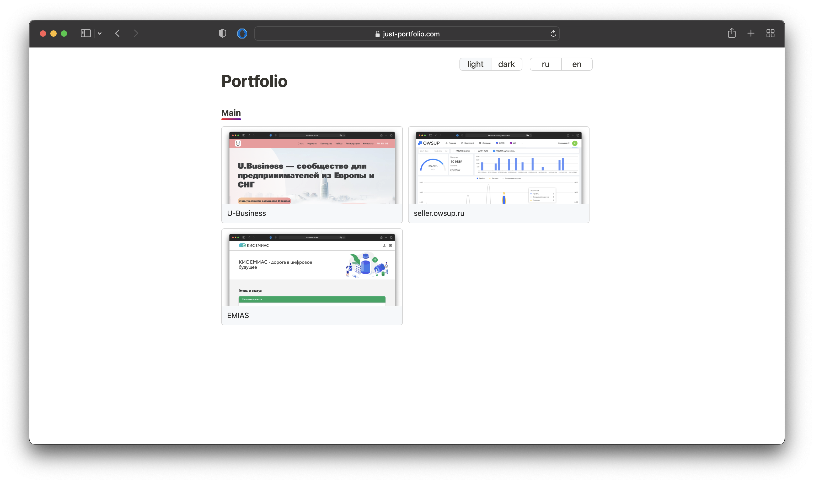

# Front-end for just-portfolio.com 

## About the project

A highly focused portfolio content management system

- wiew my profile on [just-portfolio](https://just-portfolio.com/nik19ta)
- wiew [figma](https://www.figma.com/file/ByR2BncjKvUtaWHV4GbUpI/just-portfolio.com?node-id=0%3A1)
- wiew [back-end](https://github.com/nik19ta/just-portfolio)
- wiew [data base](https://github.com/nik19ta/just-portfolio#db-schame) schema

### Tools

- Lang - TypeScript
- Framework - React
- State manager - Redux ToolKit
- For multilingual - i18n
- Icons/modals - [ant.d](https://ant.design/)
- For http requests - axios
- For auth - JWT 

## How to run 

### Start for local development

1. Get packages `npm i `
2. Paste host in .env file in `REACT_APP_SERVER_HOST`
3. Start `npm run start`

### Start for production 

1. Build react `npm run build`
2. [Configure Nginx](https://github.com/nik19ta/just-portfolio#configuration-nginx)
3. Сopy files to server `rsync  --archive --compress --delete . username@host:/var/www/project_name/html`

## Screenshots 

